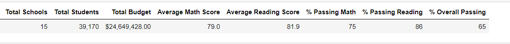
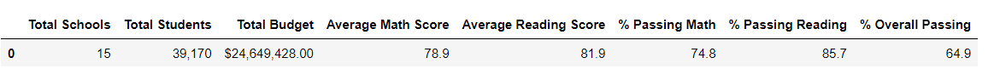
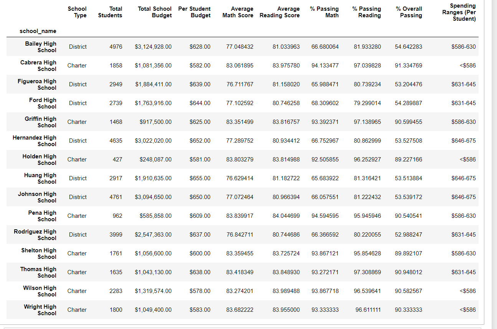
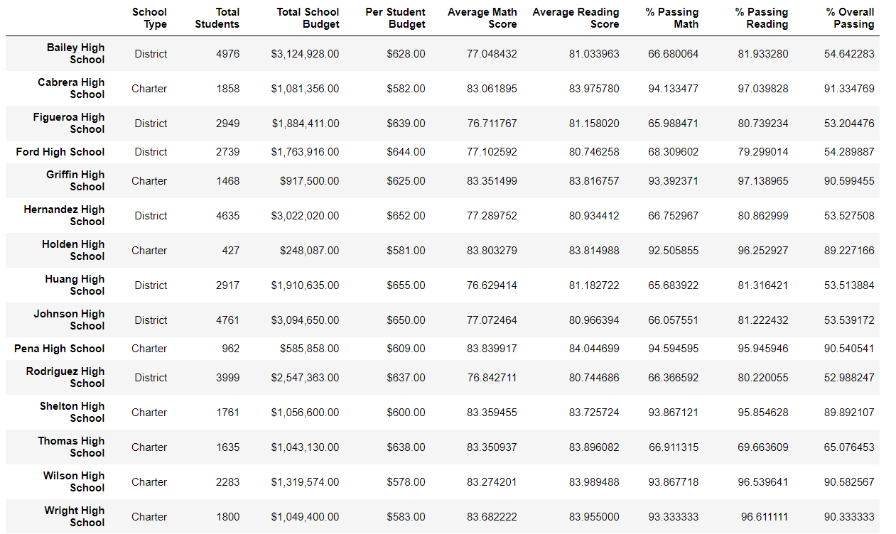
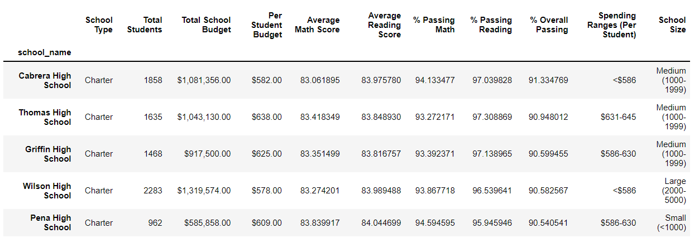
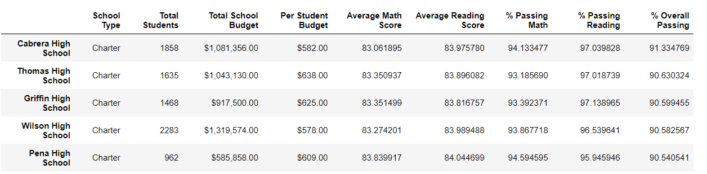
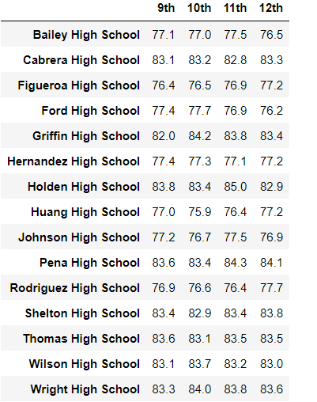
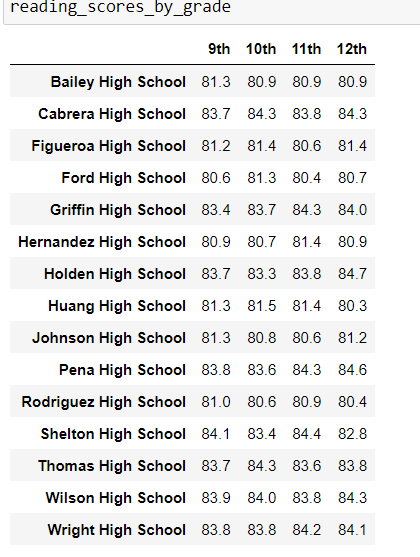
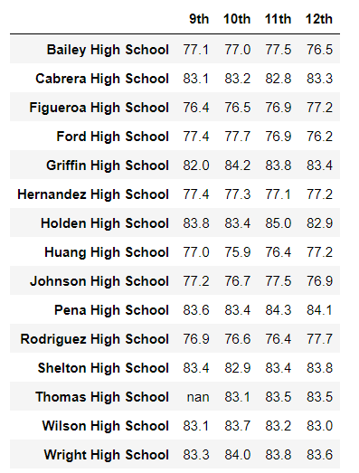
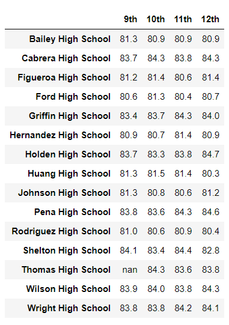

# Unit 4 Challenge – School District Analysis
## Overview of the school district analysis
### Purpose of this analysis
This project centered on standardized testing data from the high schools in a simulated school district. From CSV files containing student data, including students’ raw scores on standardized math and reading tests, along with data regarding the size, budgets, and educational models of the schools themselves, several data frames were constructed that summarized student performance on standardized tests. The metrics used to measure student performance were the average scores on the math and reading tests, the percentage of the student body that passed each test, and the percentage of the student body that passed in both math and reading. 
Subsequently, the challenge assignment started from the supposition that there had been an academic integrity violation among the ninth graders at one of the schools in the dataset, Thomas High School. The same data summaries were assembled again, this time excluding the group that was said to have been affected. Our objective is to note any changes to the data summaries when removing the suspect scores, and to observe trends in how the various traits of the schools relate to student performance.
## Results
### Effects of removing the THS ninth-grade scores
- The removal of the scores did not have a substantial impact on the performance of the district as a whole. The passing percentages (reading, math, and overall) remained the same when rounding to the nearest whole percentage point. The district’s average score in reading remained an 89.1, while the average math score dropped by only one tenth of a point, from 79 to 78.9. For reference, this is the summary including the students in question.  For comparison, this version excludes the disputed scores from the averages: 
- Naturally, removing a subset of Thomas High School’s students did not affect the other schools’ entries in the summary by school. Thomas High continues to be classified as a charter school, with 1635 total students and a budget of $638 per student. With the removal of the 461 scores that were called into question, THS saw its average math score decline from 83.41 to 83.35, but the average reading score actually increased from 83.84 to 83.89. The changes were slightly more significant in terms of the school’s overall pass rate, which fell from 90.9% to 90.6%. The original summary can be seen here:  And the summary excluding the affected students is here: 
- With or without the ninth grade scores included, Thomas High ranked among the top five schools in the district in terms of overall passing percentage. In fact, even with the affected scores removed, Thomas High remained second by that measure, between Cabrera and Griffin High Schools. The removal of the ninth graders did, however, cause Thomas to fall behind Griffin in terms of its passing percentage on the reading test. Regardless of whether the ninth grade scores are included, Thomas High somewhat underperformed in math passing percentage relative to the schools near it in the overall passing percentage, ranking lower in math than Griffin, Wilson, and Pena High Schools. The original ranking of the top five schools can be seen here:  and the new version with the ninth grade from THS removed is here: 
- Effects on analysis of subgroups of schools
 - Grouping by grade level resulted in a very simple change: the location of the ninth graders for Thomas High School was replaced with a placeholder for a non-existent value, while all the other numbers remained the same as before. Here are the tables from before the scores were removed in math:  and reading: Compared to the ones after the scores were removed in math:  and in reading: 
-By spending:
-By size:
-By school type: 

## Summary
Changes to the updated analysis after replacing the Thomas High School ninth-grade scores with NaNs include the following:
-
-
-
-

