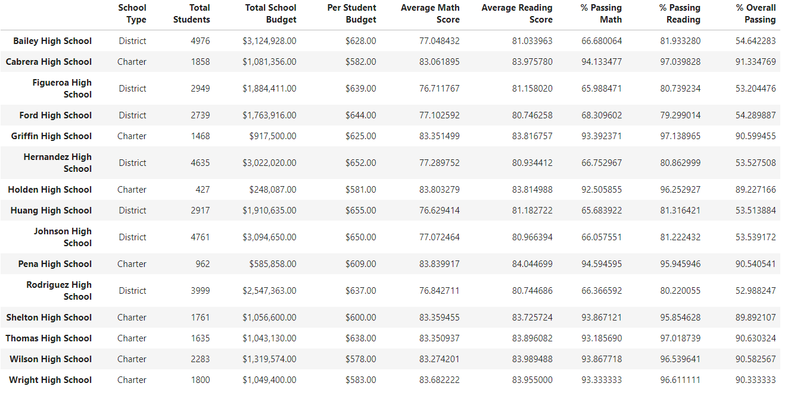

# Unit 4 Challenge – School District Analysis
## Overview of the school district analysis
### Purpose of this analysis
This project centered on standardized testing data from the high schools in a simulated school district. From CSV files containing student data, including students’ raw scores on standardized math and reading tests, along with data regarding the size, budgets, and educational models of the schools themselves, several data frames were constructed that summarized student performance on standardized tests. The metrics used to measure student performance were the average scores on the math and reading tests, the percentage of the student body that passed each test, and the percentage of the student body that passed in both math and reading. 
Subsequently, the challenge assignment started from the supposition that there had been an academic integrity violation among the ninth graders at one of the schools in the dataset, Thomas High School. The same data summaries were assembled again, this time excluding the group that was said to have been affected. Our objective is to note any changes to the data summaries when removing the suspect scores, and to observe trends in how the various traits of the schools relate to student performance.
## Results
### Effects of removing the THS ninth-grade scores
- The removal of the scores did not have a substantial impact on the performance of the district as a whole. The passing percentages (reading, math, and overall) remained the same when rounding to the nearest whole percentage point. The district’s average score in reading remained an 89.1, while the average math score dropped by only one tenth of a point, from 79 to 78.9. For reference, this is the summary including the students in question.  For comparison, this version excludes the disputed scores from the averages: 
- Naturally, removing a subset of Thomas High School’s students did not affect the other schools’ entries in the summary by school. Thomas High continues to be classified as a charter school, with 1635 total students and a budget of $638 per student. With the removal of the 461 scores that were called into question, THS saw its average math score decline from 83.41 to 83.35, but the average reading score actually increased from 83.84 to 83.89. The changes were slightly more significant in terms of the school’s overall pass rate, which fell from 90.9% to 90.6%. The original summary can be seen here:  And the summary excluding the affected students is here: 
- With or without the ninth grade scores included, Thomas High ranked among the top five schools in the district in terms of overall passing percentage. In fact, even with the affected scores removed, Thomas High remained second by that measure, between Cabrera and Griffin High Schools. The removal of the ninth graders did, however, cause Thomas to fall behind Griffin in terms of its passing percentage on the reading test. Regardless of whether the ninth grade scores are included, Thomas High somewhat underperformed in math passing percentage relative to the schools near it in the overall passing percentage, ranking lower in math than Griffin, Wilson, and Pena High Schools. The original ranking of the top five schools can be seen here:  and the new version with the ninth grade from THS removed is here: 
- Effects on analysis of subgroups of schools
	- Grouping by grade level resulted in a very simple change: the location of the ninth graders for Thomas High School was replaced with a placeholder for a non-existent value, while all the other numbers remained the same as before. The math average that was removed was among the highest for ninth graders in the district, but it was not out of line with the performance of many other charter schools, or the other grades at the same school. Similarly, the removed reading scores were not the strongest ninth grade in the district, nor were they the highest for a grade level at Thomas High. Here are the tables from before the scores were removed in math:  
and reading: Compared to the ones after the scores were removed in math: 
 
and in reading: 
	- Because Thomas High has a budget of $638 per student, it falls into the second-highest category of per-capita spending in our analysis. Before removing the ninth-graders, the analysis of spending categories looked like this: 
Now, with the 9th grade scores removed, we instead have this: . The net effect of removing the scores that were under suspicion seems to have been negligible in this analysis; schools of a similar size to Thomas High maintained the same averages and percentages either way. Displaying the data frames prior to formatting does show some slight changes in the group that includes THS, but said changes were not enough to alter the outcome once the rounding part of our formatting step was applied.
	- When grouping the schools by size, Thomas High falls into the “medium” category, with 1,635 students. The original analysis by school size produced this result:

While the analysis after dropping the scores came out like this:

Once again, it appears that removing the 9th grade scores from Thomas High did not have a substantial impact on the overall performance of the category in which the school was contained.
	- The average charter school score for reading prior to the changes was 83.5, and the math average for charter schools was 83.9. Because the removed students averaged 83.7 and 83.6 in those respective categories, the impact of their scores being disqualified was once again minimal. Prior to the scores being dropped, the comparison between charter and district schools looked like this: 

Removing the ninth grade from Thomas High gave this summary instead: 
Again, any changes to the averages or percentages were not great enough to be seen after the rounding and formatting steps were completed. Regardless of the dropped scores, it continues to be true that the charter schools are outperforming their district counterparts by a substantial margin in each of the testing metrics.

## Summary
Changes to the updated analysis after replacing the Thomas High School ninth-grade scores with NaNs include the following:
- The math test performance statistics for Thomas High declined slightly; the average math score decreased from 83.41 to 83.35, while the percentage of students there who passed the math test dropped from 93.27% to 93.19%. 
- Removing the ninth-grade scores, surprisingly, increased the average reading score at Thomas High from 83.85 to 83.90. The percentage of students who passed the reading test, however, still declined from 97.3% to 97.0%
- With the new, lower passing rates, Thomas High no longer holds the highest percentage of students passing reading in the district. Instead, it now stands in third, behind Griffin and Cabrera High Schools.
- After the scores were removed, the overall district averages and percentages in both subjects declined by a few hundredths of a point each. This could be attributed to the loss of grades from a charter school, which overall have tended to be higher than those of the other district schools throughout our analysis.

